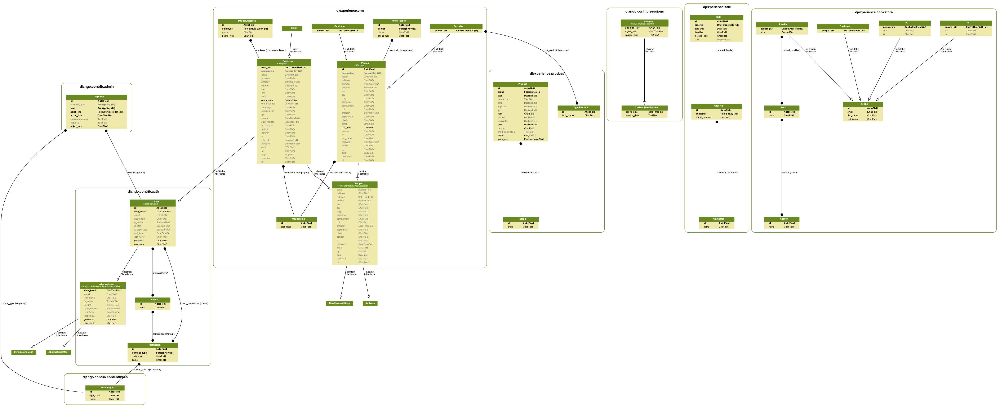

# Apps e Tabelas

Veja em [tables_django.md][0] a relação de apps e tabelas usadas no projeto.

### Bookstore

**Bookstore** será uma app separada do escopo principal. Inicialmente ela tem uma modelagem, puramente didática, que mostra como funciona alguns tipos de relacionamentos do Django, por exemplo:

* [abstract-base-classes][1]
* [multi-table-inheritance][2]
* [proxy-models][3]

### Core

Base do projeto. Nele constam algumas tabelas abstratas como:

* TimeStampedModel
* Address

### CRM

Gerenciamento de pessoas, funcionários, clientes e fornecedores.

#### Customer

A tabela *Customer* é um *proxy model* de *Person*. Seu comportamento será dado pelo *person_type* igual a "customer".

#### Employee

A tabela *Employee* é herdada de *User*. Permitindo o acesso do funcionário ao sistema de login.

#### Seller

A tabela *Seller* é um *proxy model* de *Employee*. Seu comportamento será dado pelo *occupation* igual a "Vendedor".


### Product

Descrição dos produtos.

### Selling

Gerenciamento de vendas.

### Buying

Cria pedidos de compras.

### Proposal

Gerenciamento de orçamentos.

### Stock

Gerenciamento de estoque e recebimento de produtos.


## Modelos

Para gerar o gráfico do modelo façamos o seguinte:

```bash
sudo apt-get install graphviz libgraphviz-dev pkg-config
pip install pygraphviz
git clone https://github.com/nlhepler/pydot
cd pydot
python setup.py install
cd ..
rm -rf pydot
pip install django-extensions
pip install pyparsing
```

Para gerar o gráfico

```console
./manage.py graph_models -a -g -o dev/djexperience.png
```

Eu criei um Makefile onde você pode digitar, por exemplo:

```console
make mer n="02"
```



## Gerando dados randômicos

## Comandos personalizados

## JSON e DataTable

Estava precisando renderizar uma tabela num template HTML a partir de um JSON. Então eu fiz o seguinte:

```html
# base_crm_list.html
<!-- jQuery -->
<script src="https://code.jquery.com/jquery-2.1.4.min.js"></script>
<!-- dataTables -->
<script src="https://cdn.datatables.net/1.10.13/js/jquery.dataTables.min.js"></script>
```

Em `crm/views.py`

```python
# views.py
from django.http import HttpResponse
from django.core import serializers

def customer_json(request):
    customers = Customer.objects.all()
    json = serializers.serialize('json', customers)
    return HttpResponse(json, content_type='application/json')


def customer_json_render(request):
    return render(request, 'crm/customer_json.html')
```

Em `crm/urls.py`

```python
# urls.py
url(r'^json/$', c.customer_json, name='customer_json'),
url(r'^render/$', c.customer_json_render, name='customer_json_render'),
```

Em `crm/templates/crm/customer_json.html`

```html
# customer_json.html




  <title>CRM|Customer</title>




<div class="ui main text container">
    <h1 class="ui header">Clientes</h1>
    <p>Gerencie seus clientes.</p>

  <table class="ui celled table" id="example">
    <thead>
      <tr>
        <th>Nome</th>
        <th>E-mail</th>
      </tr>
    </thead>
    <tbody></tbody>
  </table>
</div>

<script type="text/javascript" class="init">
  $(document).ready(function() {
    $('#example').dataTable( {
      "processing": true,
      "ajax": {
        "processing": true,
        "url": "",
        "dataSrc": ""
      },
      "columns": [
        { "data": "fields.first_name" },
        { "data": "fields.email" },
      ]
    });
  });
</script>


```

[Referência][4]

## Exportar para Excel

```
pip install xlwt
```

```python
# views.py
def export_users_xls(request):
    response = HttpResponse(content_type='application/ms-excel')
    response['Content-Disposition'] = 'attachment; filename="customers.xls"'

    wb = xlwt.Workbook(encoding='utf-8')
    ws = wb.add_sheet('Customers')

    # Sheet header, first row
    row_num = 0

    font_style = xlwt.XFStyle()
    font_style.font.bold = True

    columns = ['Nome', 'Sobrenome', 'E-mail', 'Nascimento', 'Criado em']

    for col_num in range(len(columns)):
        ws.write(row_num, col_num, columns[col_num], font_style)

    # Sheet body, remaining rows
    default_style = xlwt.XFStyle()

    rows = Customer.objects.all().values_list('first_name',
                                              'last_name',
                                              'email',
                                              'birthday',
                                              'created')
    for row, rowdata in enumerate(rows):
        row_num += 1
        for col, val in enumerate(rowdata):
            if isinstance(val, datetime):
                val = val.strftime('%d/%m/%Y %H:%M')
            elif isinstance(val, date):
                val = val.strftime('%d/%m/%Y')
            ws.write(row_num, col, val, default_style)

    wb.save(response)
    return response
```

```python
# urls.py
from djexperience.crm import views as c

customer_patterns = [
    # ...
        url(r'^export/xls/$', c.export_users_xls, name='export_users_xls'),
]
```

```html
# customer_list.html
<a href="">Exportar Excel</a>
```

[Referência][5]

[0]: https://github.com/rg3915/django-experience/blob/master/dev/tables_django.md
[1]: https://docs.djangoproject.com/en/1.9/topics/db/models/#abstract-base-classes
[2]: https://docs.djangoproject.com/en/1.9/topics/db/models/#multi-table-inheritance
[3]: https://docs.djangoproject.com/en/1.9/topics/db/models/#proxy-models
[4]: http://codeshard.github.io/datatables-and-django-finally-with-ajax.html
[5]: https://simpleisbetterthancomplex.com/tutorial/2016/07/29/how-to-export-to-excel.html