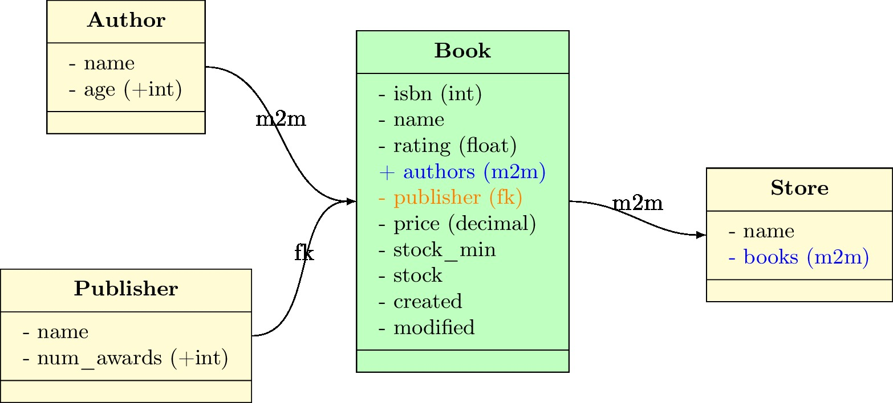

# ORM - Entendendo os relacionamentos do Django

## One to One (um para um)

Neste tipo de relacionamento também usamos **chave estrangeira**, só que um registro de uma tabela se relaciona apenas com um registro da outra tabela.

Uma **venda** pode ser feita a partir de apenas um **pedido**, então para reproduzir o esquema acima, usamos o seguinte código:

<pre>
    class Ordered(TimeStampedModel):
        customer = models.ForeignKey('Customer', verbose_name=_('cliente'), related_name='cliente_pedido')
        status = models.CharField(_('status'), max_length=2, choices=status_list, default='pe')

    class Sale(models.Model):
        ordered = models.<b>OneToOneField</b>('Ordered', verbose_name=_('pedido'))
        paid = models.BooleanField(_('pago'), default=False)
        date_paid = models.DateTimeField(_('pago em'), null=True, blank=True)
        method = models.CharField(_('forma de pagto'), max_length=20, blank=True)
        deadline = models.CharField(_('prazo de entrega'), max_length=50, blank=True)
</pre>

## One to Many (um para muitos)

É o relacionamento onde usamos **chave estrangeira**, conhecido como **ForeignKey**.

Um **cliente** pode fazer vários **pedidos**, então para reproduzir o esquema acima, usamos o seguinte código:

<pre>
    class Customer(models.Model):
        name = models.CharField(_('nome'), max_length=30)

    class Ordered(TimeStampedModel):
        customer = models.<b>ForeignKey</b>('Customer', verbose_name=_('cliente'), related_name='cliente_pedido')
        status = models.CharField(_('status'), max_length=2, choices=status_list, default='pe')
</pre>

## Many to Many (muitos para muitos)

Este relacionamento permite que vários registros de uma tabela se relacione com vários registros da outra tabela.

Um **autor** pode ter vários **livros** e cada **livro** pode ter vários **autores**, então para reproduzir o esquema acima, usamos o seguinte código:

<pre>
    class Author(models.Model):
        name = models.CharField(_('nome'), max_length=50, unique=True)
        age = models.PositiveIntegerField(_('idade'))

    class Book(TimeStampedModel):
        isbn = models.IntegerField()
        name = models.CharField(_('nome'), max_length=50)
        rating = models.FloatField(_(u'classificação'))
        authors = models.<b>ManyToManyField</b>('Author', verbose_name='autores')
        publisher = models.ForeignKey('Publisher', verbose_name='editora')
        price = models.DecimalField(_(u'preço'), max_digits=5, decimal_places=2)
        stock_min = models.PositiveIntegerField(_(u'Estoque mínimo'), default=0)
        stock = models.IntegerField(_('Estoque atual'))
</pre>

E o mesmo para **lojas**.

<pre>
    class Store(models.Model):
        name = models.CharField(_('nome'), max_length=50)
        books = models.<b>ManyToManyField</b>('Book', verbose_name='livros')
</pre>

Por baixo dos panos o Django cria uma terceira tabela (escondida).

    
Neste caso, temos dois livros com dois autores cada.

    id|book_id|author_id
    1|1|1
    2|1|2
    3|2|3
    4|2|4

E ainda, na sequência temos dois livros diferentes do mesmo autor.

    id|book_id|author_id
    5|3|5
    6|4|5

### Mais um exemplo

Um outro exemplo legal é o caso onde vários **livros** podem ser entregues por vários **fornecedores**.

## Abstract Model
## Multi table inheritance
## Proxy models
