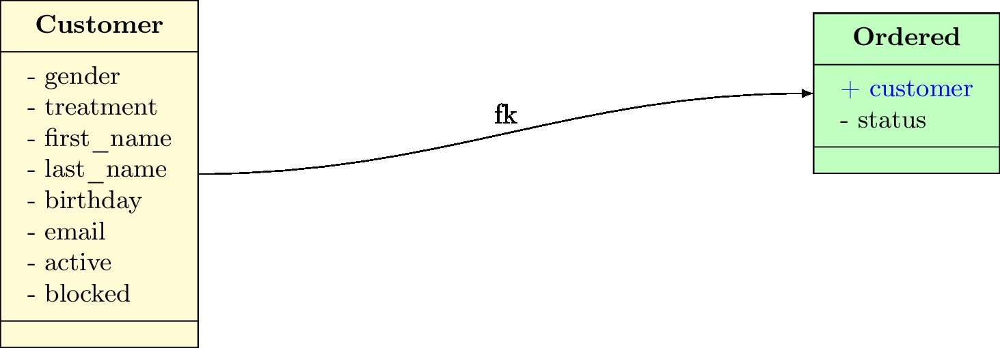
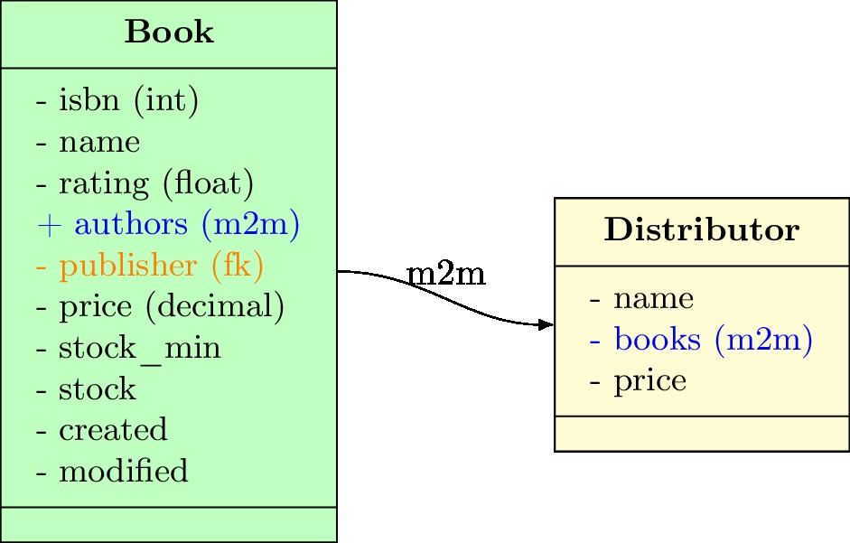
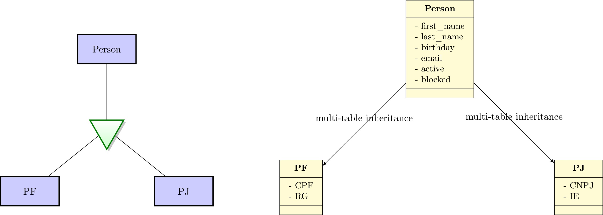
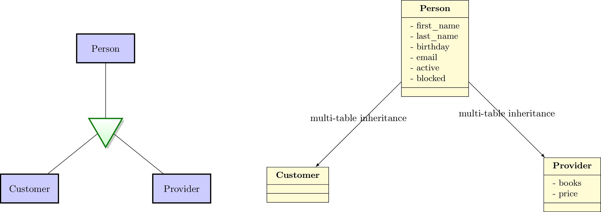
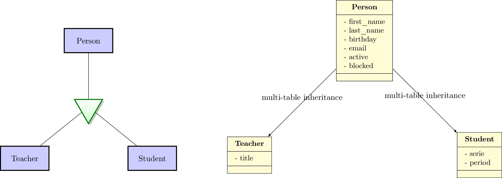

# ORM - Entendendo os relacionamentos do Django

## One to One (um para um)

Neste tipo de relacionamento também usamos **chave estrangeira**, só que um registro de uma tabela se relaciona apenas com um registro da outra tabela.


Uma **venda** pode ser feita a partir de apenas um **pedido**, então para reproduzir o esquema acima, usamos o seguinte código:

<pre>
    class Ordered(TimeStampedModel):
        customer = models.ForeignKey('Customer', verbose_name=_('cliente'), related_name='cliente_pedido')
        status = models.CharField(_('status'), max_length=2, choices=status_list, default='pe')


    class Sale(models.Model):
        ordered = models.<b>OneToOneField</b>('Ordered', verbose_name=_('pedido'))
        paid = models.BooleanField(_('pago'), default=False)
        date_paid = models.DateTimeField(_('pago em'), null=True, blank=True)
        method = models.CharField(_('forma de pagto'), max_length=20, blank=True)
        deadline = models.CharField(_('prazo de entrega'), max_length=50, blank=True)
</pre>


## One to Many (um para muitos)

É o relacionamento onde usamos **chave estrangeira**, conhecido como **ForeignKey**.



Um **cliente** pode fazer vários **pedidos**, então para reproduzir o esquema acima, usamos o seguinte código:

<pre>
    class Customer(models.Model):
        name = models.CharField(_('nome'), max_length=30)


    class Ordered(TimeStampedModel):
        customer = models.<b>ForeignKey</b>('Customer', verbose_name=_('cliente'), related_name='cliente_pedido')
        status = models.CharField(_('status'), max_length=2, choices=status_list, default='pe')
</pre>


## Many to Many (muitos para muitos)

Este relacionamento permite que vários registros de uma tabela se relacione com vários registros da outra tabela.


Um **autor** pode ter vários **livros** e cada **livro** pode ter vários **autores**, então para reproduzir o esquema acima, usamos o seguinte código:

<pre>
    class Author(models.Model):
        name = models.CharField(_('nome'), max_length=50, unique=True)
        age = models.PositiveIntegerField(_('idade'))


    class Book(TimeStampedModel):
        isbn = models.IntegerField()
        name = models.CharField(_('nome'), max_length=50)
        rating = models.FloatField(_(u'classificação'))
        authors = models.<b>ManyToManyField</b>('Author', verbose_name='autores')
        publisher = models.ForeignKey('Publisher', verbose_name='editora')
        price = models.DecimalField(_(u'preço'), max_digits=5, decimal_places=2)
        stock_min = models.PositiveIntegerField(_(u'Estoque mínimo'), default=0)
        stock = models.IntegerField(_('Estoque atual'))
</pre>

E o mesmo para **lojas**.

<pre>
    class Store(models.Model):
        name = models.CharField(_('nome'), max_length=50)
        books = models.<b>ManyToManyField</b>('Book', verbose_name='livros')
</pre>

Por baixo dos panos o Django cria uma terceira tabela (escondida).


    
Neste caso, temos dois livros com dois autores cada.

    id|book_id|author_id
    1|1|1
    2|1|2
    3|2|3
    4|2|4

E ainda, na sequência temos dois livros diferentes do mesmo autor.

    id|book_id|author_id
    5|3|5
    6|4|5

### Mais um exemplo

Um outro exemplo legal é o caso onde vários **livros** podem ser entregues por vários **fornecedores**.




## Abstract Inheritance (Herança Abstrata)

Neste tipo de modelo o Django cria novas tabelas a partir de uma tabela abstrata (base).

As novas tabelas são uma **cópia** da primeira.

Não existe relacionamento entre elas. Mas campos adicionais podem ser criados nas novas tabelas.


<pre>
    class Person(models.Model):
        gender = models.CharField(_(u'gênero'), max_length=1, choices=gender_list)
        treatment = models.CharField(
            _('tratamento'), max_length=4, choices=treatment_list, blank=True)
        first_name = models.CharField(_('nome'), max_length=30)
        last_name = models.CharField(_('sobrenome'), max_length=30)
        birthday = models.DateTimeField(_('nascimento'), null=True, blank=True)
        email = models.EmailField(_('e-mail'), blank=True)
        active = models.BooleanField(_('ativo'), default=True)
        blocked = models.BooleanField(_('bloqueado'), default=False)

    class Meta:
        <b>abstract = True</b>


    class Customer(Person):
        pass


    class Seller(Person):
        internal = models.BooleanField(_('interno'), default=True)
        commissioned = models.BooleanField(_('comissionado'), default=True)
        commission = models.DecimalField(
            _(u'comissão'), max_digits=6, decimal_places=2, default=0.01, blank=True)
</pre>

Note que a tabela **Customer** é uma cópia de **Person**, e **Seller** também é uma cópia, mas com campos adicionais.


## Multi-table Inheritance (Herança Multi-tabela)

Na herança múltipla o Django cria um relacionamento **um pra um (OneToOne)** automaticamente entre as tabelas.



Entrando no banco de dados vemos que a tabela `core_pf` possui um campo chamado `customer_ptr_id`....


... e que os ids vão de 21 a 40, neste exemplo.

Note que são os mesmos ids na tabela `customer`.


E se você digitar...

    sqlite> .schema core_pf
    CREATE TABLE "core_pf" ("customer_ptr_id" integer NOT NULL PRIMARY KEY REFERENCES 
    "core_customer" ("id"), "cpf" varchar(11) NOT NULL, "rg" varchar(10) NOT NULL);

... você verá nitidamente que existe um relacionamento um pra um entre eles.

### Outro exemplo



### Outro exemplo




## Proxy models

O [proxy models] não cria uma nova tabela, ele apenas muda o **comportamento** de uma tabela no Django. Ou seja, o Django interpreta duas tabelas diferentes, mas no banco de dados existe apenas uma.

### Exemplo

Um exemplo interessante é quando eu tenho uma tabela *Funcionário*, mas eu preciso da tabela *Vendedor*. Pra economizar tabela no banco de dados eu posso dizer que todo funcionário cujo **cargo é vendedor** pertence a "tabela" *Vendedor*.

```python
class Employee(People, User):
    occupation = models.ForeignKey(
        'Occupation', verbose_name='cargo', related_name='employee_occupation',
        null=True, blank=True)
    internal = models.BooleanField('interno', default=True)
    commissioned = models.BooleanField('comissionado', default=True)
    commission = models.DecimalField(
        u'comissão', max_digits=6, decimal_places=2, default=0.01)


class SellerManager(models.Manager):

    def get_queryset(self):
        return super(SellerManager, self).get_queryset()\
            .filter(occupation__occupation='Vendedor')


class Seller(Employee):
    objects = SellerManager()

    class Meta:
        proxy = True
        verbose_name = 'vendedor'
        verbose_name_plural = 'vendedores'
```

Note o comando `proxy = True` em *Seller*.